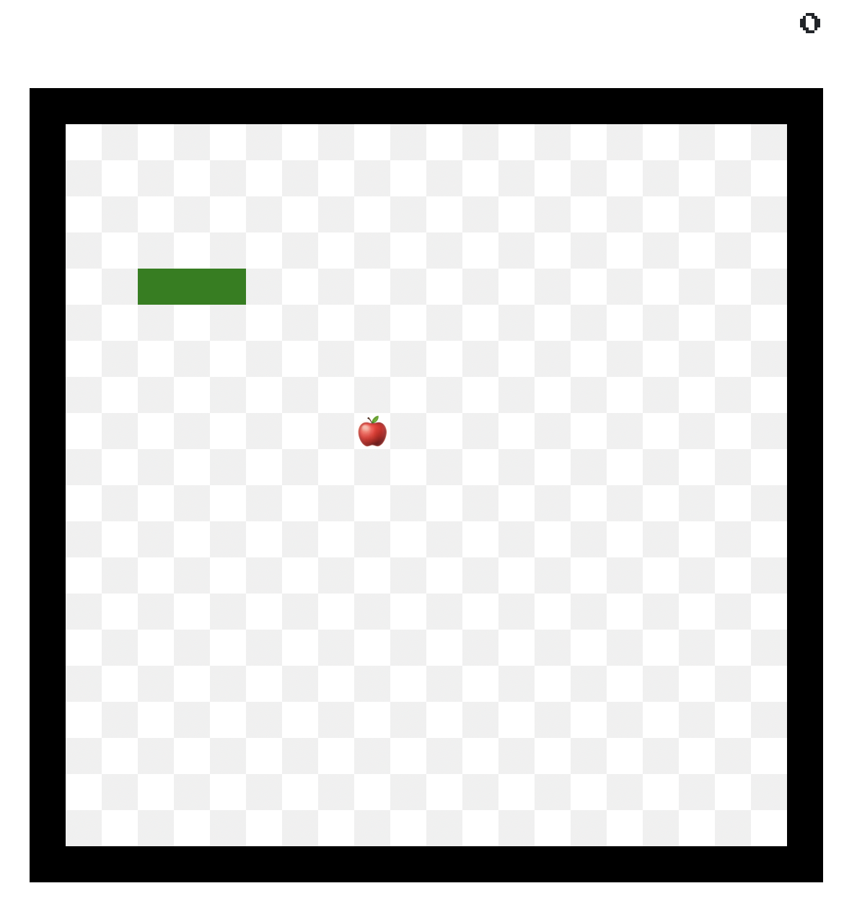

# Lær Svelte ved å lage Snake

En workshop av [Eirik Vågeskar](https://github.com/vages)

<!-- prettier-ignore-start -->

<!-- toc -->

- [Intro: Vi skal lage spillet Snake i Svelte](#intro-vi-skal-lage-spillet-snake-i-svelte)
  * [Svelte](#svelte)
  * [Du må ha følgende på datamaskinen din](#du-ma-ha-folgende-pa-datamaskinen-din)
  * [Slik pleier kurset å være](#slik-pleier-kurset-a-vaere)
- [Del 1: Enkel grafikk](#del-1-enkel-grafikk)
  * [Opplæring: Slik ser en Svelte-fil ut](#opplaering-slik-ser-en-svelte-fil-ut)
  * [Oppgave 1.1: Plasser eplet](#oppgave-11-plasser-eplet)
  * [Opplæring: each-blokker](#opplaering-each-blokker)
  * [Oppgave 1.2: Tegn slangekroppen på skjermen](#oppgave-12-tegn-slangekroppen-pa-skjermen)
  * [Oppgave 1.3: Trekk koordinat-utregningen ut i en funksjon](#oppgave-13-trekk-koordinat-utregningen-ut-i-en-funksjon)
- [Del 2: Spillkontroller](#del-2-spillkontroller)
  * [Opplæring: Å lytte etter input](#opplaering-a-lytte-etter-input)
  * [Oppgave 2.1: Lytt til trykk på tastaturet](#oppgave-21-lytt-til-trykk-pa-tastaturet)
  * [Opplæring: Å endre variabelverdier](#opplaering-a-endre-variabelverdier)
  * [Oppgave 2.2: Beveg slangen ett steg i den retningen brukeren trykker](#oppgave-22-beveg-slangen-ett-steg-i-den-retningen-brukeren-trykker)
- [Del 3: Logikk](#del-3-logikk)
  * [Opplæring: Dollartegnet i Svelte – reaktive utsagn.](#opplaering-dollartegnet-i-svelte-%E2%80%93-reaktive-utsagn)
  * [Oppgave 3.1: Gi poeng når slangen spiser eplet](#oppgave-31-gi-poeng-nar-slangen-spiser-eplet)
  * [Oppgave 3.2: Få slangen til å vokse når den spiser eplet](#oppgave-32-fa-slangen-til-a-vokse-nar-den-spiser-eplet)
  * [Opplæring: Svelte-komponenters livssyklus, pluss setInterval](#opplaering-svelte-komponenters-livssyklus-pluss-setinterval)
  * [Oppgave 3.3: Få spillet til å «tikke»](#oppgave-33-fa-spillet-til-a-%C2%ABtikke%C2%BB)
  * [Oppgave 3.4 Stopp tikking når slangen dør](#oppgave-34-stopp-tikking-nar-slangen-dor)
  * [Oppgave 3.5: Bare reager på tastetrykk som er vinkelrette](#oppgave-35-bare-reager-pa-tastetrykk-som-er-vinkelrette)
  * [Oppgave 3.6: Bruk en kø til å holde styr på fremtidige bevegelser](#oppgave-36-bruk-en-ko-til-a-holde-styr-pa-fremtidige-bevegelser)
- [Del 4: Animasjon](#del-4-animasjon)
  * [Opplæring: Kontroll-blokker](#opplaering-kontroll-blokker)
  * [Opplæring: Hvordan overganger fungerer](#opplaering-hvordan-overganger-fungerer)
  * [Oppgave 4.1: Animer eplet](#oppgave-41-animer-eplet)
  * [Hint: Bruk en egnet blokk](#hint-bruk-en-egnet-blokk)
  * [Oppgave 4.2: Legg på en hodeskalle når slangen dør](#oppgave-42-legg-pa-en-hodeskalle-nar-slangen-dor)
  * [Oppgave 4.3: Animer slangehodet](#oppgave-43-animer-slangehodet)
  * [Oppgave 4.4: Animer slangehalen](#oppgave-44-animer-slangehalen)
- [Del 5: Komponenter og nettverk](#del-5-komponenter-og-nettverk)
  * [Opplæring: Komponenter](#opplaering-komponenter)
  * [Oppgave 5.1: Lag en komponent som dukker opp ved spillslutt](#oppgave-51-lag-en-komponent-som-dukker-opp-ved-spillslutt)
  * [Advarsel: Resten av del 5 er vanskelig](#advarsel-resten-av-del-5-er-vanskelig)
  * [Opplæring: Await-blokker](#opplaering-await-blokker)
  * [Oppgave 5.2: Hent high-scores fra API-et](#oppgave-52-hent-high-scores-fra-api-et)
  * [Opplæring: Binde variabler til input-felter](#opplaering-binde-variabler-til-input-felter)
  * [Oppgave 5.3: Legg til et felt der folk kan fylle inn navnet sitt](#oppgave-53-legg-til-et-felt-der-folk-kan-fylle-inn-navnet-sitt)
- [Del 6: Game Over?](#del-6-game-over)
  * [Oppgave 6.1: Forbedre spillet](#oppgave-61-forbedre-spillet)
  * [Oppgave 6.2: Alternative spill](#oppgave-62-alternative-spill)
  * [Oppgave 6.3: Etter dette kurset](#oppgave-63-etter-dette-kurset)
  * [Avsluttende ord](#avsluttende-ord)

<!-- tocstop -->

<!-- prettier-ignore-end -->

## Intro: Vi skal lage spillet Snake i Svelte


### Svelte

[Svelte](https://svelte.dev) er et bittelite webrammeverk. Slik presenteres det på hjemmesiden:

> Svelte is a radical new approach to building user interfaces. Whereas traditional frameworks like React and Vue do the bulk of their work in the browser, Svelte shifts that work into a compile step that happens when you build your app.
>
> Instead of using techniques like virtual DOM diffing, Svelte writes code that surgically updates the DOM when the state of your app changes.
>
> We're proud that Svelte was recently voted the [most loved framework](https://insights.stackoverflow.com/survey/2021#section-most-loved-dreaded-and-wanted-web-frameworks) with the [most satisfied developers](https://2020.stateofjs.com/en-US/technologies/front-end-frameworks/) in a pair of industry surveys. We think you'll love it too. Read [the introductory blog post](https://svelte.dev/blog/svelte-3-rethinking-reactivity) to learn more.

#### Fordelene med Svelte

Applikasjonene man skriver i Svelte blir som regel [mindre og raskere enn en tilsvarende applikasjon hadde blitt i React eller Vue](https://www.freecodecamp.org/news/a-realworld-comparison-of-front-end-frameworks-with-benchmarks-2019-update-4be0d3c78075/).


### Du må ha følgende på datamaskinen din

- [node](https://nodejs.org/en/)
- En tekstbehandler, fortrinnsvis [en der man kan installere støtte for Svelte](https://github.com/sveltejs/integrations#editor-extensions).
- En klone av [Vages/svelte-snake-workshop](https://github.com/Vages/svelte-snake-workshop)

Hvis du trenger hjelp til installasjon, kan du sjekke [SETUP.md](../SETUP.md).

### Slik pleier kurset å være

Repoet [Vages/svelte-snake-workshop](https://github.com/Vages/svelte-snake-workshop) inneholder alt du trenger. Du kan bestemme tempo selv. Det skal være mulig å fullføre kurset helt på egen hånd.

Kurset er delt opp i 6 deler. Hver del inneholder to eller flere oppgaver. Hver oppgave starter med oppgavetekst, som av og til blir fulgt av hint. Du kan la være å lese hintene om du trenger en ekstra utfordring. Bytt til `task-X-begin` før du løser hver nye oppgave (eksempelvis `git checkout task-1.2-begin`). `task-X-end` er oppgavens fasit. For å fjerne koden du har lagt til og gå videre til ny oppgave, kan du skrive `git stash` og deretter `git checkout task-X-begin`.

Når vi holder kurset fysisk eller digitalt, pleier vi å gå gjennom oppgaver og spørsmål i fellesskap med ujevne mellomrom. Du kan be om hjelp fra kursholderne når som helst.

Vi har laget så å si all styling på forhånd, slik at man kan bruke mest mulig tid på kode.

## Del 1: Enkel grafikk

Når denne delen er ferdig, skal vi ha et brett med en slange og et eple.

### Opplæring: Slik ser en Svelte-fil ut

Svelte er en sammensmeltning av HTML, CSS og Javascript. Om du kan disse fra før, kan du bruke mye av det i Svelte.

I Svelte kan man skrive Javascript, CSS og HTML i én og samme fil. Delene kalles for «script», «template» og «styling».

```svelte
<!-- script -->
<script>
  let answer = 42;
  let color = "red";
</script>

<!-- template -->
<div style="color: {color}">
  Hello world, the answer is {answer}
</div>

<!-- styling -->
<style>
  div {
    font-weight: bold;
  }
</style>
```

Som vi akkurat hintet til, bruker man krøllparenteser inni _template_ for å sette inn variabler, utregninger og funksjonskall.

```svelte
<script>
  let answer = 42;
</script>

<div>Meningen med livet er {a}.</div>
<div>Kvadratet av meningen er {a * a}</div>
<div>Meningen med livet har {Math.sign(a)} som fortegn</div>
```

Løs [oppgaven fra Svelte-opplæringen om å sette inn data](https://svelte.dev/tutorial/adding-data) før du går videre.

### Oppgave 1.1: Plasser eplet

Åpne filen `src/routes/_game/App.svelte`.

På brettet har vi en `<div class="apple" />`. I variabelen `apple` ligger en koordinat. Plasser eplet på den ruten på brettet som angis av koordinaten.

X-aksen på brettet går mot høyre, og Y-aksen peker ned. Sidelengden på hver rute i rutenettet er lagret i konstanten `CELL_SIZE`.


Det skal altså se ut som følger.


#### Hint: Style-attributtet

For å overstyre og legge til stil på elementer i HTML (ikke bare Svelte), kan man bruke attributtet `style`. Inni style skriver man CSS-utsagn.

```svelte
<div style="font-weight: bold;">Fet skrift</div>
```

#### Hint: left og top i css

I CSS bruker man `left` og `top` for å forskyve elementer i henholdsvis `x`- og `y`-retning.

```svelte
<div style="top: 20px; left: 10px;">Forskjøvet</div>
```

#### Hint: For å avsløre nesten alt

For å plassere eplet, må du gjøre omtrent som følger:

```svelte
<div class="apple" style="left: {regnestykke1}px; top: {regnestykke2}px;" />
```

Du må benytte deg av `apple.x` og `apple.y` samt `CELL_SIZE` for å få til disse regnestykkene.

### Opplæring: each-blokker

Den kommende oppgaven kommer til å kreve en each-blokk.

Løs denne oppgaven fra Svelte-opplæringen for å lære hvordan [en each-blokk fungerer](https://svelte.dev/tutorial/each-blocks).

### Oppgave 1.2: Tegn slangekroppen på skjermen

I denne oppgaven skal du tegne slangen på brettet.

Slangen er en samling koordinater og ligger i variabelen `snake`. Det første elementet er hodet. Hver koordinat i kroppen skal tegnes som en `<div class="body-part" />`.

Slik skal slangen være plassert på brettet når du har gjort alt riktig:



### Oppgave 1.3: Trekk koordinat-utregningen ut i en funksjon

Utregningen for å plassere noe på brettet (`x * CELL_SIZE`) er gjentatt flere ganger i koden. Slike gjentakelser gjør at man må gjøre samme endring flere steder dersom man vil endre logikken.

Flytt den dupliserte utregningen over i en funksjon, `calculatePositionAsStyle(coordinate)`. Den skal returnere en streng med verdier for top og left.

## Del 2: Spillkontroller

Når du er ferdig med del 2, skal det gå an å styre slangen med piltastene.

### Opplæring: Å lytte etter input

Løs følgende oppgaver fra Svelte-opplæringen før du går videre:

- [Lytte etter DOM-hendelser på et element](https://svelte.dev/tutorial/dom-events)
- [Lytte etter DOM-hendelser på selve vinduet](https://svelte.dev/tutorial/svelte-window)

### Oppgave 2.1: Lytt til trykk på tastaturet

I denne oppgaven skal du lytte etter trykk på tastaturet og sende dem videre til funksjonen `console.log`. Applikasjonen skal kunne «høre» tastetrykk uansett hvilken del av nettsiden som har fokus, altså skal ikke brukeren måtte ha trykket på et spesifikt element på siden for at spillet skal registrere tastetrykkene.

Unngå å lytte på tastetrykk fra hele vinduet (`svelte:window` viser til vinduet i sin helhet). Legg heller til en lytter på det Svelte-spesifikke elementet som viser til `document.body`.

#### Hint: Tastetrykk-hendelsen

Tastetrykk-hendelsen heter `keydown`. I Svelte lytter man etter den med `on:keydown`.

#### Hint: svelte:body

Vi lytter til `document.body` ved å bruke elementet `<svelte:body />`. Du kan lytte etter hendelser på `svelte:body` akkurat slik du ville gjort med et hvilket som helst HTML-element.

### Opplæring: Å endre variabelverdier

Du kommer til å måtte vite hvordan du endrer variabler i den kommende seksjonen. Gjør følgende oppgaver fra Svelte-opplæringen før du fortsetter:

- [Oppdatere vanlige variabler](https://svelte.dev/tutorial/reactive-assignments)
- [Oppdatere arrays og objekter](https://svelte.dev/tutorial/updating-arrays-and-objects)

### Oppgave 2.2: Beveg slangen ett steg i den retningen brukeren trykker

Nå skal vi oversette tastetrykk til bevegelse. Slangen skal bevege seg ett steg i oppgitt retning hver gang man trykker på en piltast. Unngå at slangen beveger seg når man trykker på andre taster.

For å gjøre dette lettere, har vi laget en funksjon `convertKeyboardKeyToDirection` i `utils.js`, som oversetter fra tastetrykk til en retning. I kodebasen har vi valgt å bruke himmelretningene for å vise til retningene på brettet: Vest er venstre, nord er opp.

Inntil videre skal slangen bevege seg også om den går inni seg selv eller utenfor brettet. Game over kommer i en senere oppgave.

#### Hint: Viktige Array-funksjoner

- Den enkleste måten å legge til elementer i starten eller slutten i et array, er å bruke spredning (_spreading_): `[a, ...b]`. (Svelte reagerer ikke hvis du bruker push og pop; dette kommer vi tilbake til senere.)
- Funksjonen [Array.prototype.slice](https://developer.mozilla.org/en-US/docs/Web/JavaScript/Reference/Global_Objects/Array/slice) er nyttig når man vil fjerne elementer fra starten og slutten av et array.

#### Hint: Hjelpemidler i `utils.js`

I `utils.js` finner du:

- `add(coordinateA, coordinateB)`, som kan legge sammen to vektorer/koordinater.
- `DIRECTION_TO_VECTOR`, som man kan bruke for å gå fra himmelretning til retningsvektor.

Legg til linjen `import { DIRECTION_TO_VECTOR, add } from './utils'` øverst i `<script>` for å bruke dem.

## Del 3: Logikk

Når du er ferdig med denne delen, skal man få poeng når slangen spiser eplet. Spillet skal stoppe hvis slangen er på en ulovlig posisjon. Og spillklokka skal tikke, slik at slangen beveger seg på gitte tidspunkter, heller enn når man trykker på piltastene.

### Opplæring: Dollartegnet i Svelte – reaktive utsagn.

I regneark, som Microsoft Excel, kan man skrive formler i cellene, for eksempel `=A1*B3`. Da havner resultatet av regnestykket i cellen, og resultatet oppdaterer seg automatisk når man endrer innholdet i cellene som regnestykket avhenger av. Slik er det vanligvis ikke i programmering: Man kan ikke si `a = 2; b = a * 2; a = 8` og regne med at `b` nå er 16 i stedet for 4 fordi det dobbelte av 8 er 16. Men i Svelte er det mulig.

I Svelte kan vi få datamaskinen til å kjøre et _kodeutsagn_ (statement) på nytt som reaksjon på endringer. Dette gjør vi ved å sette et dollartegn foran det. Utsagn som starter med et slikt dollartegn kalles for et _reaktivt utsagn_, fordi utsagnet kjøres som en reaksjon på noe annet.

Hvis utsagnet inneholder en tilegning til en variabel, kan Svelte holde verdien oppdatert for oss.

```svelte
<script>
  let b = 3;
  let c = 4;

  $: a = (b * c) / 2; // a === 6
  b = 6;
</script>

<div>
  <!-- 
    Uten `$: …` hadde a hatt verdien 6, 
    men den får automatisk verdien 12 etter 
    at man har gitt b en ny verdi. 
  -->
  Trekantens grunnlinje er {b}, og høyden er {c}. Arealet er {a}.
</div>
```

Løs [oppgaven om reaktive utsagn fra Svelte-opplæringen](https://svelte.dev/tutorial/reactive-statements) før du går videre.

Nesten hva som helst kan stå etter dollartegnet, ikke bare utregninger. Man kan også skrive funksjonskall og if-setninger:

```svelte
<script>
  let lastUserInput = "";
  $: if (lastUserInput === "hello") {
    console.log("hello to you too"); // Svarer når brukeren skriver inn strengen hello
  }
</script>

<label>Skriv noe: <input bind:value={lastUserInput} /></label>
```

```svelte
<script>
  let lastUserInput = "";
  $: parrotOutput = parrot(lastUserInput); // Gjentar alt brukeren sier, fulgt av papegøyelyd

  function parrot(something) {
    return something + ", sqawk!";
  }
</script>

<label>Si noe: <input bind:value={lastUserInput} /></label>
<div>
  Papegøyen sier: {parrotOutput}
</div>
```

Et reaktivt utsagn kjøres én gang når appen lastes inn. Deretter kjøres utsagnet på nytt som en reaksjon på at en verdi som brukes inni utsagnet gis en ny verdi et annet sted i appen. Svelte merker bare endringer som kommer som en følge av man bruker tilegnelsesoperatoren, `=` (for eksempel `foo.bar = "baz"`), og ikke som følge av metodekall (som `.push` og `.pop`). Se [opplæringsoppgaven om reaktivitet med objekter og arrays](https://svelte.dev/tutorial/updating-arrays-and-objects) for en dypere forklaring.

Svelte finner automatisk ut hvilke verdier som brukes inni et utsagn. Du trenger ikke oppgi avhengighetene selv, slik som med for eksempel `React.useEffect`.

Når du skriver spill-logikk, kan du ofte oversette regler nesten direkte til reaktive utsagn: «Hvis `x === foo`, så gjør a, b og c» blir til `$: if (x === foo) { a(); b(); c(); }`.

### Oppgave 3.1: Gi poeng når slangen spiser eplet

Lag en variabel `score`. Dette er antallet epler slangen har spist.

I denne oppgaven skal du skrive et reaktivt utsagn med en if-setning slik at når slangehodet er på samme koordinat som eplet, øker antallet poeng med 1.

Når du har poeng-økningen til å virke, kan du sørge for at eplet får en ny, tilfeldig plassering på brettet idet slangen spiser det.

Merk: Her sparer du mye arbeid ved å bruke hjelpefunksjoner fra `utils.js`.

#### Hint: Hjelp i utils.js

I `utils.js` finner du funksjonen `isEqual` som sier deg om to koordinater er like, og funksjonen `pickRandomOpenSpace`, som trekker en passelig plassering for det nye eplet.

### Oppgave 3.2: Få slangen til å vokse når den spiser eplet

Nå skal du få slangen til å vokse etter at den har spist et eple.

For å gjøre det lettere for deg, har vi trukket ut logikken for å regne ut neste slange i funksjonen `getNextSnake(snake, direction, ?shouldGrow)`. `shouldGrow` er et valgfritt tredje argument, og er en boolsk.

### Opplæring: Svelte-komponenters livssyklus, pluss setInterval

For å løse den kommende oppgaven, kommer du til å måtte kunne det du lærer av følgende oppgaver i Svelte-opplæringen:

- [Oppgaven om `onMount`](https://svelte.dev/tutorial/onmount)
- [Oppgaven om `onDestroy`](https://svelte.dev/tutorial/ondestroy) (som inneholder litt om `setInterval`)

### Oppgave 3.3: Få spillet til å «tikke»

I denne oppgaven skal du få slangen til bevege seg ved faste tidsintervaller i stedet for idet man trykker på piltaster. Når tiden for å bevege seg er inne, skal slangen bevege seg i den retningen som spilleren sist oppga. I demoversjonen av spillet er tidsintervallet 100 ms, men du kan endre dette om du vil.

### Oppgave 3.4 Stopp tikking når slangen dør

Når slangehodet går utenfor brettet eller treffer en annen del av slangekroppen, er spillet slutt – _game over_.

I denne oppgaven skal du innføre _game over_ ved å stoppe tikkingen dersom en av de nevnte tilstandene inntreffer. Stoppet skal skje som en _reaksjon_ på at slangen har beveget seg, og ikke som en del av `moveSnake`.

For å stoppe tikkingen, har vi trukket ut en funksjon `stopTicking` som du kan bruke.

#### Hint: Hjelpefunksjoner

I `utils.js` finner du `isInsideBoard` og `isSnakeEatingItself`. Disse vil være til stor hjelp.

#### Hint: Reaktivitet

Husk reaktivitet og if-setninger: `$: if (x) { … }`, og hvordan man nesten ordrett kan oversette spill-logikk til dette.

Hvis vi skulle formulert reglene for game over muntlig, hadde vi sagt noe slikt som:

- «Hvis slangen ikke er innenfor brettet eller slangen spiser seg selv, er det game over»
- «Hvis det er game over, stopper tikkingen»

### Oppgave 3.5: Bare reager på tastetrykk som er vinkelrette

Idet du har fått game over til å virke, kommer du kanskje til å oppdage et problem: Slangen dør når man trykker tasten som går i stikk motsatt retning av slangens bevegelsesretning fordi den spiser halsen sin. Dette kan også skje når man er litt rask idet man prøver å ta en U-sving. I denne og den neste deloppgaven skal vi unngå at spillere opplever dette.

I denne oppgaven skal du sørge for at slangen kun reagerer på tastetrykk som er vinkelrette på slangens nåværende retning. Hvis slangen går nordover, skal du altså bare registrere tastetrykk på venstre og høyre piltast. Som med mange andre oppgaver, finnes det en funksjon som kan hjelpe deg i `utils.js`.

### Oppgave 3.6: Bruk en kø til å holde styr på fremtidige bevegelser

**Denne oppgaven er en utfordringsoppgave som har mer å gjøre med programmering enn Svelte i seg selv. Du kan hoppe til neste oppgave hvis du ønsker.**

I løsningen på oppgave 3.5 som man finner i `task-3.5-end`, kan man fortsatt fremprovosere at slangen spiser seg selv hvis man er rask: Hvis slangen for eksempel beveger seg nordover og spilleren raskt trykker ⬅️ fulgt av ⬇️, ender spillet opp med å registrere ⬇️ som neste bevegelse.

Vi kan unngå problemet ved å bruke en _kø_ til å ta vare på retningene som slangen skal bevege seg i. Når slangen skal bevege seg, henter vi neste planlagte retning og beveger slangen i den. Da kan spilleren trykke inn avanserte bevegelser raskt uten å tenke på timing.

Vi har laget variabelen `headDirectionQueue`, et array som holder styr på retningene brukeren har planlagt at slangen skal bevege seg i. I stedet for å legge neste planlagte retning rett i `headDirection`, skal du legge retningen sist i `headDirectionQueue`. Når tiden for at slangen skal bevege seg er inne, skal programmet bruke _den første vinkelrette retningen_ i køen som ny verdi for `headDirection`. Med andre ord: Dropp alle ikke-vinkelrette bevegelser fra starten av køen frem til du finner en vinkelrett bevegelse. Bruk denne og la påfølgende bevegelser bli liggende i køen som de er.

Gjør de endringene som trengs i `moveSnake` og `handleKeydown`.

## Del 4: Animasjon

Det grunnleggende spillet er ferdig. Neste steg er animasjon.

I Svelte følger modulen `svelte/transition` med. Den gjør at man kan animere et element som dukker opp eller forsvinner fra dokumentet.

Når denne delen er over, skal vi ha en animert hodeskalle, eple og slange.

### Opplæring: Kontroll-blokker

- [if-blokker](https://svelte.dev/tutorial/if-blocks)
- [else-blokker](https://svelte.dev/tutorial/else-blocks)
- [key-blokker](https://svelte.dev/tutorial/key-blocks)

### Opplæring: Hvordan overganger fungerer

- [transition-attributtet](https://svelte.dev/tutorial/transition)
- [Hvordan man kan legge parametere på overganger](https://svelte.dev/tutorial/adding-parameters-to-transitions)
- [Forskjellig animasjon på inn og ut](https://svelte.dev/tutorial/in-and-out)

### Oppgave 4.1: Animer eplet

For å lede spillerens oppmerksomhet i retning av nye epler, skal du få det nye eplet til å sprette opp på plassen sin når slangen spiser det forrige eplet.

For å få til dette skal du importere overgangen `scale` fra `svelte/transition` og legge den på riktig element. For å begrense animasjonen til når eplet dukker opp, bruker du `in:` i stedet for `transition:`. (Du kan også prøve [andre overganger](https://svelte.dev/docs#svelte_transition).)

### Hint: Bruk en egnet blokk

Normalt sett pleier Svelte bare å animere elementer dersom de forsvinner inn eller ut av dokumentet. Du kan fortelle Svelte at elementet skal animeres på nytt når en verdi endrer seg ved å bruke en key-blokk: `{#key <verdi>}<innhold>{/key}`. Da vil Svelte animere `innhold` på nytt når `verdi` endrer seg.

### Oppgave 4.2: Legg på en hodeskalle når slangen dør

I stylingen finnes det en klasse `skull`. I denne oppgaven skal du få en `<div/>` med klassen `skull` til å dukke opp når slangen dør, og den skal ha samme koordinat som slangehodet.

For å animere hodeskallen, legg på en `transition:scale` med en forsinkelse på 300 ms.

### Oppgave 4.3: Animer slangehodet

I style-blokken finnes det en klasse `head`. Denne sørger for styling og animasjon av slangehodet så lenge man setter den på et element med klassen `body-part` . Legg inn et animert slangehode ved hjelp av denne klassen.

Du kommer ikke til å trenge å bruke noe `transition:…` her. Stylingen tar seg av animasjonen så lenge du legger riktig klasse på rett sted.

### Oppgave 4.4: Animer slangehalen

Nå skal vi animere halen. Det finnes en klasse, `tail`, som man kan legge på et element for å få den samme gli-animasjonen som for hodet, men uten forstørrelse av kroppsdelen.

Legg til en animert hale på slangen.

Advarsel:

- **Det er en rendering-bug i Safari og Chrome** som blir bedre av en workaround i fasiten som vi ikke kan fortelle hvordan virker, fordi det ville avslørt løsningen.
  - Om du bruker Safari eller Chrome, kan du regne oppgaven som løst når du har en animert, litt blinkete hale.
  - Dersom du bruker Firefox, vil du sannsynligvis ikke merke noe.

## Del 5: Komponenter og nettverk

I denne delen skal vi lage en game-over-skjerm. Denne skal hente en high-score-liste fra en tjener. På skjermen skal man også kunne registrere navnet sitt og sende siste poengsum til tjeneren.

### Opplæring: Komponenter

Gjør følgende oppgaver fra Svelte-opplæringen:

- [Nøstede komponenter](https://svelte.dev/tutorial/nested-components)
- [Å erklære props](https://svelte.dev/tutorial/declaring-props)

### Oppgave 5.1: Lag en komponent som dukker opp ved spillslutt

Filen `GameOver.svelte` ligger klar i samme mappe som `App.svelte`. I denne oppgaven skal du sørge for at komponenten vises på skjermen når spillet er over og at den viser poengsummen som spilleren fikk.

PS: Fordi det er litt knotete å få komponenten til å vises på skjermen på en elegant måte, har vi lagt inn noen div-er nederst der du kan montere `<GameOver>`-komponenten.

### Advarsel: Resten av del 5 er vanskelig

Resten av oppgavene i del 5 er for folk som har erfaring med nettverkskall, løfter (_promises_) og lignende i Javascript. Om du synes oppgavene blir for vanskelige å løse, kan du hoppe til del 6.

### Opplæring: Await-blokker

I Javascript-finnes det noe som heter løfter – _promises_ på engelsk. Et løfte brukes når man har et funksjonskall som kan ta tid og muligens kan mislykkes. De brukes ofte til nettverksforespørsler.

Løs [oppgaven om await-blokker fra Svelte-opplæringen](https://svelte.dev/tutorial/await-blocks) før du går videre.

### Oppgave 5.2: Hent high-scores fra API-et

Svelte-kit-prosessen som kjøres under utvikling inneholder en liten i-minne-database med en high-score-liste som man kan hente ut tidligere poengsummer fra og poste sin siste poengsum til.

Funksjonen `fetchScores` fra `api.js` henter topplista. Importer denne funksjonen og vis topplista i «Game Over» komponenten du har laget.

[comment]: <> (Serveren kan bruke tid på å svare, så pass på å gi visuell tilbakemelding til brukeren på at forespørselen er underveis. Serveren er satt til å feile på 40 % av alle kall, så pass også på å bruke catch-blokken for å vise brukeren at noe gikk feil. Lag en knapp som prøver på nytt dersom forespørselen feilet.)

Dersom du ønsker å bruke samme visuelle tema som for resten av spillet, kan du sjekke [dokumentasjonen for stilarket Nes.css](https://nostalgic-css.github.io/NES.css/) (eller fasiten).

Advarsel: Akkurat når man jobber med løfter, kan navngitte funksjoner (de som er definert med nøkkelordet `function`) oppføre seg rart. For å unngå bugs, bruk pilfunksjoner (altså `const foo = () => {…}`).

### Opplæring: Binde variabler til input-felter

Løs [oppgaven om tekst-input og binding](https://svelte.dev/tutorial/text-inputs) før du går videre.

### Oppgave 5.3: Legg til et felt der folk kan fylle inn navnet sitt

Lag et felt der folk kan fylle inn navnet sitt. Lag også en knapp som folk kan trykke på for å sende inn navn og poengsum på formatet `{ name: string, score: number }`. Du kan bruke funksjonen `postScore` fra `api.js` til dette.

Når poengsummen er sendt inn, skal komponenten hente den oppdaterte topplisten.

Merk: Fordi databasen ikke lagres til noe permanent minne, vil alt man har lagt til i den forsvinne når man starter utviklingstjeneren på nytt. Hvis du ødelegger databasen ved å sende inn feilformatert data, kan du avslutte utviklingstjeneren og starte den på nytt for å starte med blanke ark.

## Del 6: Game Over?

Gratulerer! **Du var veldig flink som leste gjennom oppgavesettet før du begynte!** Eller kanskje du faktisk har gjort alle oppgavene? Wooooaaahh!!!!!1


Del 6 er en sandkasse der du kan gjøre omtrent hva du vil.

### Oppgave 6.1: Forbedre spillet

Det finnes fortsatt noen mulige forbedringer av spillet:

#### Oppgaver du ikke finner løsningen på i main

Følgende funksjoner har vi ikke selv prøvd å lage (ennå), men vi tror de er både løsbare – og gøyale:

- **«Hull» i kantene**: Hull i kantene på brettet som gjør at man kan komme ut av et tilsvarende hull på den andre siden, som i Pacman.
- **Hindringer på brettet**: Visse områder midt på brettet er umulige å gå gjennom – kall dem vegger, øyer eller hva som helst. De er som kanten av brettet: Slangen dør når den treffer kanten av et slikt område.
- **Gullepler**: Fra tid til annen kan det dukke opp gullepler i tillegg til det vanlige eplet. Disse gir 5 ekstra poeng hvis man spiser dem innen en viss tid.
- **Lydeffekter**: Legg på lyder når slangen spiser eplet, når den dør og lignende. Husk å bruke hodetelefoner dersom du deler arbeidslokale med andre.

Hvis du ikke føler deg helt klar for å jobbe uten fasit ennå kan du prøve deg på en oppgave du finner løsningen på i main-branchen.

#### Oppgaver som du finner løsninger på i main-branchen

Spillet som ligger i main-branchen har et par funksjoner som det ikke er laget oppgaver for:

- Pause
- Startskjerm
- Omstart-knapp på game-over-skjermen

Start med repoets tilstand slik det er etter fasiten på oppgave 5.3 og prøv å lage disse funksjonene uten å kikke på fasit.

### Oppgave 6.2: Alternative spill

Kanskje du kan lage et av følgende spill:

- [Whac-a-Mole](https://en.wikipedia.org/wiki/Whac-A-Mole) – [vi har allerede gjort et forsøk](https://mos.knowit.no/)
- [Breakout](<https://en.wikipedia.org/wiki/Breakout_(video_game)>)

### Oppgave 6.3: Etter dette kurset

Om du synes Svelte er gøy og vil lære mer, har vi følgende anbefalinger:

- Gjør [hele Svelte-opplæringen](https://svelte.dev/tutorial/)
  - Sjekk ut [dokumentasjonen](https://svelte.dev/docs) etterpå. Man kan nesten alt som står der etter opplæringen.
- Prøv ut [Svelte kit](https://kit.svelte.dev/), Sveltes motsvar til for eksempel Next.js og Nuxt.js.
  - Ditt første prosjekt kan for eksempel være en hjemmeside fylt av alle spillene dine. Legg den ut i påvente av at «flash-spill» kommer på moten igjen.

### Avsluttende ord

Da gjenstår det kun å si at vi håper du har kost deg med kurset vår. Game over!
